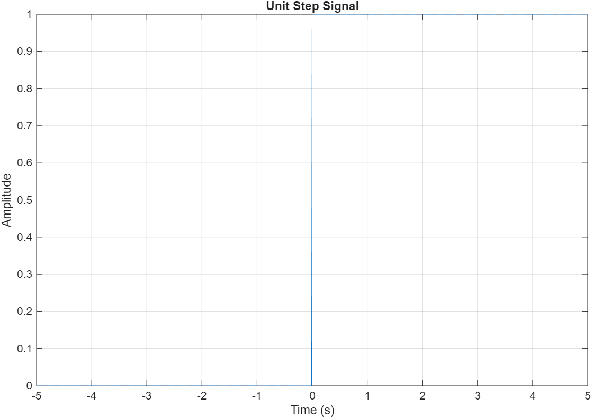
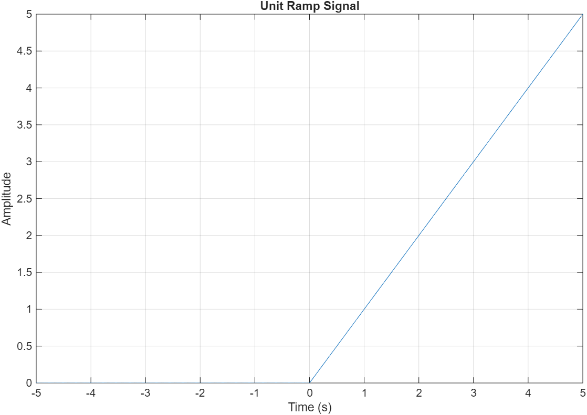
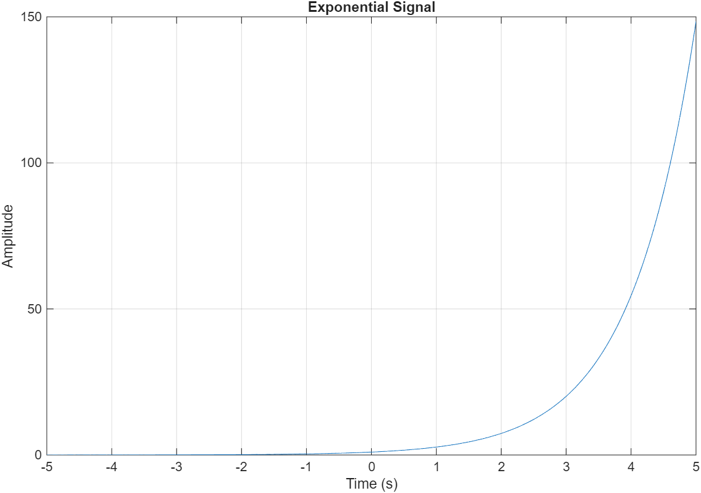
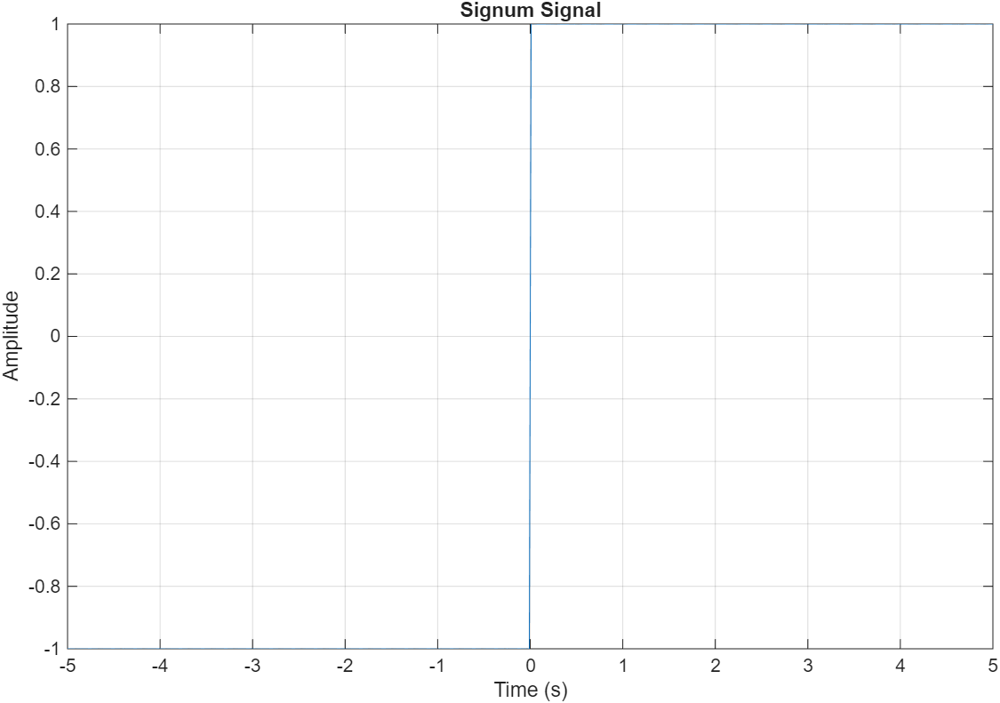

# MATLAB Signal Examples

## Description
This project is made for the second assigment of mathematical algorithms on Savonia´s University
This project demonstrates the generation and plotting of basic signals in MATLAB. The signals included are:

- **Unit Impulse**: A signal that is zero everywhere except at t = 0, where it is 1.
- **Unit Step**: A signal that is 0 for t < 0 and 1 for t ≥ 0.
- **Unit Ramp**: A signal that is 0 for t < 0 and increases linearly with time for t ≥ 0.
- **Exponential Signal**: A signal that grows exponentially with a given amplitude and time constant.
- **Signum Signal**: A signal that is -1 for t < 0, 0 at t = 0, and 1 for t > 0.
- **Sinc Signal**: A sinc function, defined as `sinc(t) = sin(pi*t)/(pi*t)` in MATLAB.

These signals are commonly used in signal processing and system analysis.

## Sample Plots

### Unit Impulse

### Unit Step

### Unit Ramp

### Exponential Signal

### Signum Signal

### Sinc Signal

